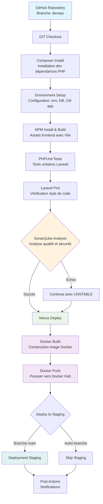
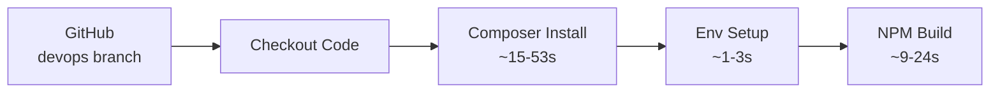
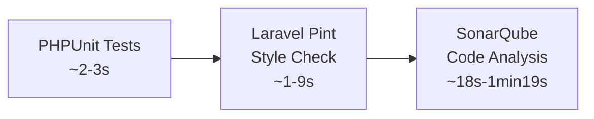
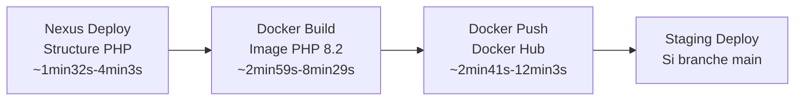

# Diagramme Pipeline DevOps - Projet ReLeaf

## Vue d'ensemble du Pipeline

Ce document présente le diagramme explicatif du pipeline CI/CD mis en place pour le projet **ReLeaf** (Application Laravel/PHP).

## Technologies utilisées

- **Source Control**: GitHub (Branche `devops`)
- **CI/CD**: Jenkins
- **Analyse de code**: SonarQube
- **Artifacts**: Nexus Repository
- **Containerisation**: Docker
- **Registry**: Docker Hub

## Diagramme du Pipeline



## Détail des Stages

### 1. **Source Control & Setup**


### 2. **Quality Assurance**


### 3. **Artifacts & Deployment**


## Structure des Artifacts Nexus

```
nexus-repo/
└── raw-releases/
    └── com/
        └── example/
            └── releaf/
                ├── application/
                │   ├── [version]/
                │   │   └── releaf-application-[version].tar.gz
                │   └── latest/
                ├── complete/
                │   ├── [version]/
                │   │   └── releaf-complete-[version].tar.gz
                │   └── latest/
                └── metadata/
                    ├── [version]/
                    │   └── project-info.json
                    └── latest/
```

## Configuration des Outils

### SonarQube
- **URL**: http://192.168.50.4:9000
- **Project Key**: releaf
- **Langages**: PHP, JavaScript
- **Plugins**: SonarPHP (inclus)

### Nexus Repository
- **URL**: http://192.168.50.4:8082
- **Repository**: raw-releases
- **Structure**: Com/Example/ReLeaf/[Type]/[Version]

### Docker
- **Base Image**: php:8.2-fpm-alpine
- **Registry**: docker.io/firaszn
- **Tags**: [BUILD_NUMBER], latest (si main)

## Métriques de Performance

| Stage | Durée Typique | Durée Max Observée |
|-------|---------------|-------------------|
| Git Checkout | 2-8s | 8s |
| Composer Install | 15-53s | 53s |
| Environment Setup | 1-3s | 3s |
| NPM Build | 9-24s | 24s |
| PHPUnit Tests | 2-3s | 3s |
| Laravel Pint | 1-9s | 9s |
| SonarQube | 18s-1min19s | 1min19s |
| Nexus Deploy | 1min32s-4min3s | 4min3s |
| Docker Build | 2min59s-8min29s | 8min29s |
| Docker Push | 2min41s-12min3s | 12min3s |

## Points de Contrôle Qualité

1. **Tests Unitaires** : PHPUnit avec gestion d'échecs gracieux
2. **Style de Code** : Laravel Pint pour la cohérence
3. **Analyse Statique** : SonarQube avec Quality Gate
4. **Artifacts Versionnés** : Structure organisée dans Nexus
5. **Images Docker** : Build et push automatiques

## Gestion des Erreurs

- **Tests échoués** : Pipeline continue avec statut UNSTABLE
- **Style Code** : Pipeline continue après détection
- **SonarQube** : Continue avec UNSTABLE si échec
- **Docker** : Continue avec UNSTABLE si échec

## Notifications

- **Succès** : Pipeline executed successfully!
- **Échec** : Pipeline failed!
- **Extensions possibles** : Email, Slack, Teams

---

*Ce pipeline assure la qualité, la traçabilité et la déployabilité continue du projet ReLeaf.*
