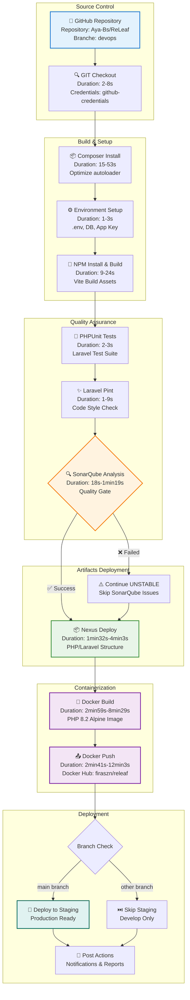
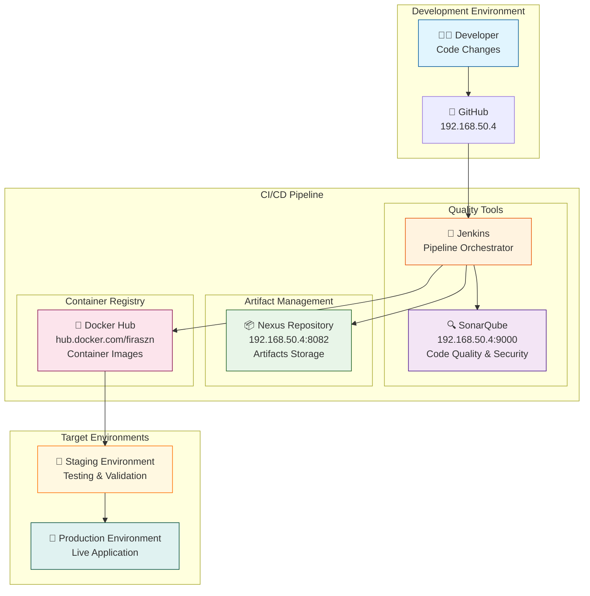
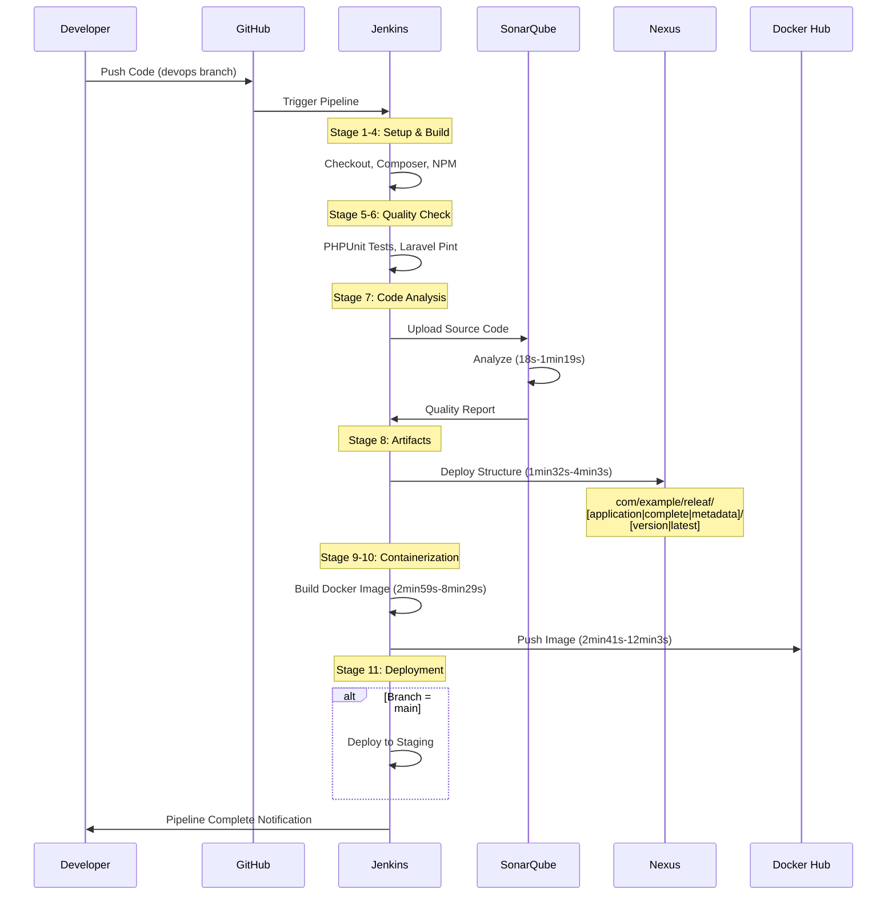
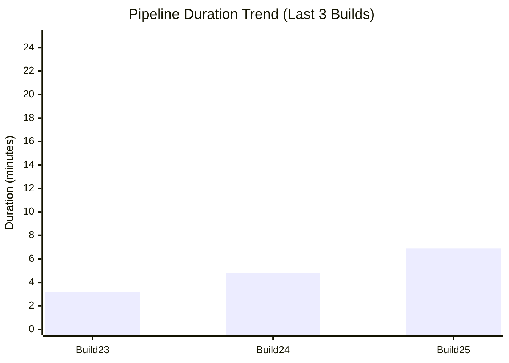

# Diagramme Pipeline ReLeaf - Version Mermaid

## Pipeline DevOps Complet



## Architecture des Outils DevOps



## Flux de Données et Métriques



## Métriques de Performance par Build



## Structure des Artifacts Déployés

```mermaid
graph TD
    subgraph "Nexus Repository Structure"
        ROOT[📁 raw-releases] --> COM[📁 com]
        COM --> EXAMPLE[📁 example]
        EXAMPLE --> RELEAF[📁 releaf]
        
        RELEAF --> APP[📁 application]
        RELEAF --> COMP[📁 complete]
        RELEAF --> META[📁 metadata]
        
        APP --> VERSION1[📁 [BUILD_NUMBER]]
        APP --> LATEST1[📁 latest]
        
        COMP --> VERSION2[📁 [BUILD_NUMBER]]
        COMP --> LATEST2[📁 latest]
        
        META --> VERSION3[📁 [BUILD_NUMBER]]
        META --> LATEST3[📁 latest]
        
        VERSION1 --> TAR1[📄 releaf-application-[version].tar.gz<br/>Laravel App Only]
        COMP --> TAR2[📄 releaf-complete-[version].tar.gz<br/>Full Project with Config]
        META --> JSON[📄 project-info.json<br/>Metadata & Dependencies]
    end
    
    style ROOT fill:#e3f2fd
    style TAR1 fill:#e8f5e8
    style TAR2 fill:#fff3e0
    style JSON fill:#f3e5f5
```

---

## Légende

| Symbole | Signification |
|---------|---------------|
| 📁 | Dossier/Répertoire |
| 🔄 | Process automatique |
| 🧪 | Tests/Validation |
| 🔍 | Analyse/Inspection |
| 📦 | Artifacts/Packages |
| 🐳 | Docker/Containers |
| 🚀 | Déploiement |
| ⚠️ | Gestion d'erreur |
| ✅ | Succès |
| ❌ | Échec |

*Ce diagramme représente l'architecture complète du pipeline DevOps pour le projet ReLeaf, incluant tous les outils, flux de données et métriques de performance observés.*
